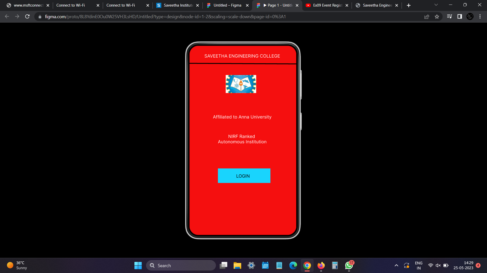
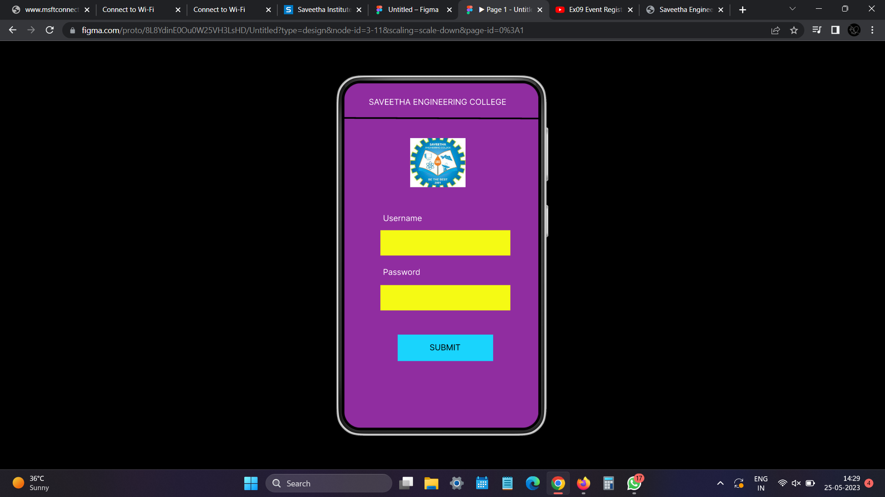
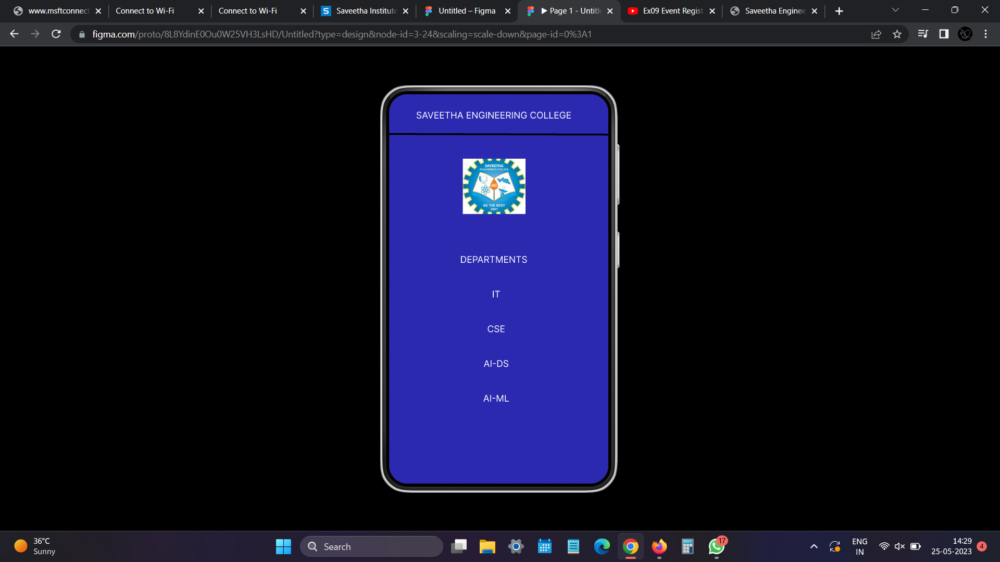

# Event Registration Web Application

## AIM:
To design, develop and deploy a web application for event registration.

## DESIGN STEPS:

### Step 1:
Create a new frame.

### Step 2:
Select any one present size on your choice.

### Step 3:
Select the shape you need.

### Step 4:
Import image as need.

### Step 5:
Create pages based on your need and link them.

### Step 6:

Validate the HTML and CSS code.

### Step 6:

Publish the website in the given URL.

## DESIGN:
Figma
## PROGRAM :
```
/* logo 1 */


position: absolute;
width: 103px;
height: 61px;
left: calc(50% - 103px/2 - 6.5px);
top: 99px;

background: url(logo.jpg);


/* SAVEETHA ENGINEERING COLLEGE */


position: absolute;
width: 312px;
height: 31px;
left: 22px;
top: 26px;

font-family: 'Inter';
font-style: normal;
font-weight: 400;
font-size: 15px;
line-height: 18px;
text-align: center;

color: #FFFFFF;


/* Affiliated to Anna University */


position: absolute;
width: 312px;
height: 31px;
left: 22px;
top: 232px;

font-family: 'Inter';
font-style: normal;
font-weight: 400;
font-size: 15px;
line-height: 18px;
text-align: center;

color: #FFFFFF;


/* NIRF Ranked Autonomous Institution */


position: absolute;
width: 312px;
height: 31px;
left: 22px;
top: 298px;

font-family: 'Inter';
font-style: normal;
font-weight: 400;
font-size: 15px;
line-height: 18px;
text-align: center;

color: #FFFFFF;


/* Rectangle 1 */


position: absolute;
width: 177px;
height: 49px;
left: 96px;
top: 415px;

background: #19D4FD;


/* LOGIN */


position: absolute;
width: 153px;
height: 32px;
left: 104px;
top: 432px;

font-family: 'Inter';
font-style: normal;
font-weight: 400;
font-size: 15px;
line-height: 18px;
text-align: center;

color: #000000;


/* Line 1 */


position: absolute;
width: 360.01px;
height: 0px;
left: 0px;
top: 61px;

border: 3px solid #000000;
transform: rotate(0.32deg);


/* SAVEETHA ENGINEERING COLLEGE */


position: absolute;
width: 312px;
height: 31px;
left: 17px;
top: 26px;

font-family: 'Inter';
font-style: normal;
font-weight: 400;
font-size: 15px;
line-height: 18px;
text-align: center;

color: #FFFFFF;


/* Username */


position: absolute;
width: 312px;
height: 31px;
left: -4px;
top: 242px;

font-family: 'Inter';
font-style: normal;
font-weight: 400;
font-size: 15px;
line-height: 18px;

color: #FFFFFF;


/* Password */


position: absolute;
width: 312px;
height: 31px;
left: -4px;
top: 342px;

font-family: 'Inter';
font-style: normal;
font-weight: 400;
font-size: 15px;
line-height: 18px;

color: #FFFFFF;


/* Line 2 */


position: absolute;
width: 360px;
height: 0px;
left: 0px;
top: 66px;

border: 3px solid #000000;
transform: rotate(0.16deg);


/* logo 2 */


position: absolute;
width: 103px;
height: 91px;
left: calc(50% - 103px/2 - 6.5px);
top: 102px;

background: url(logo.jpg);


/* Rectangle 2 */


position: absolute;
width: 241px;
height: 149px;
left: 67px;
top: 273px;

background: #F5FA14;


/* Rectangle 2 */


position: absolute;
width: 177px;
height: 49px;
left: 99px;
top: 467px;

background: #19D4FD;


/* SUBMIT */


position: absolute;
width: 158px;
height: 34px;
left: 108px;
top: 482px;

font-family: 'Inter';
font-style: normal;
font-weight: 400;
font-size: 15px;
line-height: 18px;
text-align: center;

color: #000000;


/* SAVEETHA ENGINEERING COLLEGE */


position: absolute;
width: 312px;
height: 31px;
left: 16px;
top: 26px;

font-family: 'Inter';
font-style: normal;
font-weight: 400;
font-size: 15px;
line-height: 18px;
text-align: center;

color: #FFFFFF;


/* DEPARTMENTS */


position: absolute;
width: 312px;
height: 31px;
left: 16px;
top: 263px;

font-family: 'Inter';
font-style: normal;
font-weight: 400;
font-size: 15px;
line-height: 18px;
text-align: center;

color: #FFFFFF;


/* IT */


position: absolute;
width: 312px;
height: 31px;
left: 20px;
top: 320px;

font-family: 'Inter';
font-style: normal;
font-weight: 400;
font-size: 15px;
line-height: 18px;
text-align: center;

color: #FFFFFF;


/* IT */


position: absolute;
width: 312px;
height: 31px;
left: 20px;
top: 320px;

font-family: 'Inter';
font-style: normal;
font-weight: 400;
font-size: 15px;
line-height: 18px;
text-align: center;

color: #FFFFFF;


/* CSE */


position: absolute;
width: 312px;
height: 31px;
left: 20px;
top: 377px;

font-family: 'Inter';
font-style: normal;
font-weight: 400;
font-size: 15px;
line-height: 18px;
text-align: center;

color: #FFFFFF;


/* AI-DS */


position: absolute;
width: 312px;
height: 31px;
left: 20px;
top: 434px;

font-family: 'Inter';
font-style: normal;
font-weight: 400;
font-size: 15px;
line-height: 18px;
text-align: center;

color: #FFFFFF;


/* AI-ML */


position: absolute;
width: 312px;
height: 15px;
left: 20px;
top: 491px;

font-family: 'Inter';
font-style: normal;
font-weight: 400;
font-size: 15px;
line-height: 18px;
text-align: center;

color: #FFFFFF;


/* Line 3 */


position: absolute;
width: 360px;
height: 0px;
left: 0px;
top: 67px;

border: 3px solid #000000;
transform: rotate(0.16deg);


/* logo 3 */


position: absolute;
width: 103px;
height: 91px;
left: calc(50% - 103px/2 - 7.5px);
top: 106px;

background: url(logo.jpg);
```
## OUTPUT:




## Result:

The program to design ,develop and deploy a web application for event registration is 
completed successfully.